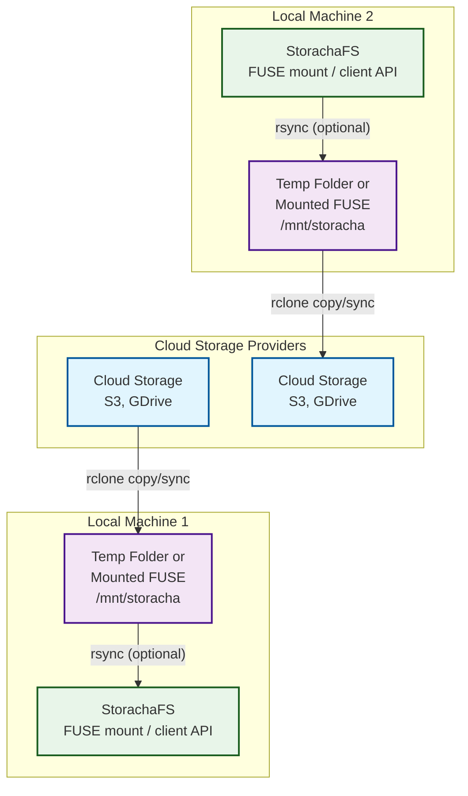
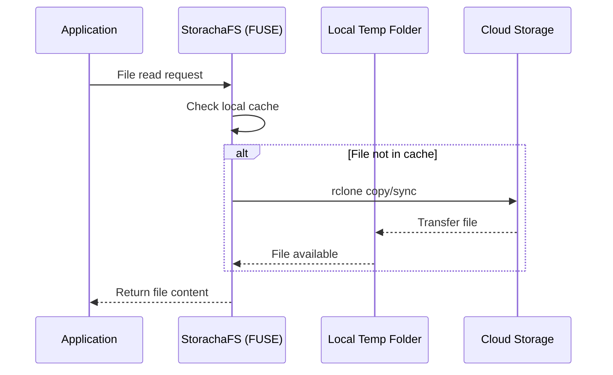
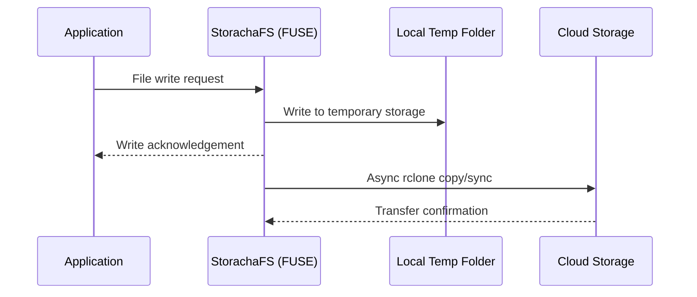
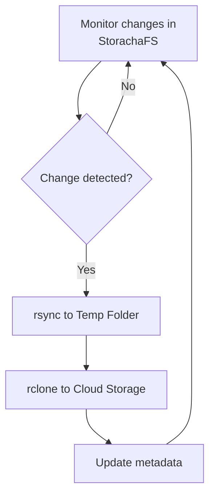

# StorachaFS Architecture Documentation

## Overview

StorachaFS is a distributed file system that provides a unified interface to access and manage files across multiple cloud storage providers while maintaining local caching for performance. This architecture enables seamless synchronization between cloud storage services and local machines through a FUSE-based interface.

## System Architecture



## Component Details

### 1. Cloud Storage Providers
**Purpose**: Primary storage backend for data persistence
**Implementation**: 
- Support for multiple cloud providers (S3, Google Drive)
- Uses standardized APIs for interoperability
- Provides durable, scalable storage

**Interfaces**:
- Cloud-native APIs (S3 REST API, Google Drive API)
- rclone compatibility layer

### 2. Local Machine Temporary Storage
**Purpose**: Local cache and staging area for files
**Implementation**:
- Can be implemented as:
  - Regular temporary folder on local filesystem
  - FUSE-mounted virtual filesystem (/mnt/storacha)
- Serves as intermediate buffer for uploads/downloads
- Provides faster access to frequently used files

**Characteristics**:
- Configurable cache size and eviction policies
- Metadata tracking for synchronization
- Optional encryption at rest

### 3. StorachaFS (FUSE Mount / Client API)
**Purpose**: Unified interface for applications to access distributed filesystem
**Implementation**:
- FUSE (Filesystem in Userspace) implementation
- Optional direct client API for programmatic access
- Virtual filesystem layer that abstracts underlying storage

**Key Features**:
- POSIX-compliant filesystem interface
- Transparent caching and synchronization
- Conflict resolution mechanisms
- Bandwidth management and throttling

## Data Flow Processes

### 1. Download Process (Cloud → Local)


### 2. Upload Process (Local → Cloud)


### 3. Synchronization Process (Optional rsync)


## Configuration Options

### Storage Backends
```yaml
storage_providers:
  - name: "aws_s3"
    type: "s3"
    bucket: "storacha-bucket"
    region: "us-west-2"
    
  - name: "google_drive"
    type: "gdrive"
    root_folder_id: "abc123"
```

### Caching Strategy
```yaml
caching:
  temp_directory: "/mnt/storacha/tmp"
  max_cache_size: "100GB"
  eviction_policy: "LRU"
  prefetch_enabled: true
```

### Synchronization Settings
```yaml
sync:
  use_rsync: true
  rsync_options: "-avz --delete"
  rclone_options: "--transfers=4 --checkers=8"
  sync_interval: "5m"
  conflict_resolution: "newer"
```

## Deployment Considerations

### Single Node Deployment
```
+----------------+       +----------------+       +----------------+
| Cloud Storage  |<----->| Local Machine  |<----->| Applications   |
| (S3, GDrive)   |       | (StorachaFS)   |       |                |
+----------------+       +----------------+       +----------------+
```

### Multi-Node Deployment
```
+----------------+       +----------------+       +----------------+
| Cloud Storage  |<----->| Local Machine 1|<----->| Applications   |
| (S3, GDrive)   |       | (StorachaFS)   |       |                |
+----------------+       +----------------+       +----------------+
        ^                         ^
        |                         |
        v                         v
+----------------+       +----------------+       +----------------+
| Cloud Storage  |<----->| Local Machine 2|<----->| Applications   |
| (S3, GDrive)   |       | (StorachaFS)   |       |                |
+----------------+       +----------------+       +----------------+
```

## Performance Optimization

### Caching Strategies
- **Metadata caching**: Fast directory listing and file attribute access
- **Content caching**: LRU-based caching of frequently accessed files
- **Prefetching**: Anticipatory reading of likely-to-be-accessed files

### Network Optimization
- **Bandwidth throttling**: Configurable limits to avoid network saturation
- **Parallel transfers**: Multiple concurrent transfers using rclone's --transfers option
- **Delta synchronization**: Only transferring changed portions of files

## Security Considerations

- **Data encryption**: Optional client-side encryption before cloud storage
- **Authentication**: OAuth2 for cloud services, API keys for programmatic access
- **Access control**: POSIX permissions mirrored to cloud storage where supported

## Monitoring and Maintenance

### Health Checks
- Cloud storage connectivity verification
- Local cache integrity checks
- Synchronization status monitoring

### Logging
- Transfer logs for audit purposes
- Performance metrics collection
- Error reporting and alerting

## References

- **rclone**: https://rclone.org/ - Tool for managing files on cloud storage
- **FUSE**: https://github.com/libfuse/libfuse - Filesystem in Userspace
- **rsync**: https://rsync.samba.org/ - Fast file transfer and synchronization tool

This architecture provides a robust foundation for a cloud-integrated filesystem that balances performance, reliability, and flexibility across multiple storage backends.